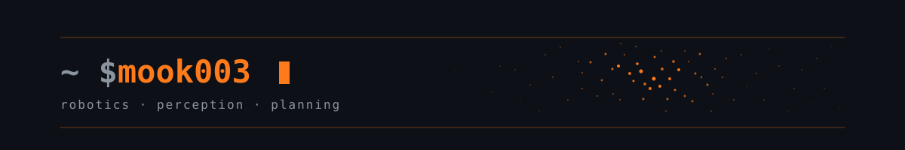

  

### Hi, I'm Evgenii

Robotics engineer building things that move, sense, and plan.  
Head of the student robotics lab at Innopolis University · research programmer at the AI Institute and CIR at Innopolis University.

---

### Currently

- Motion planning & manipulation (MoveIt2, UR10e, KUKA LBR iiwa)
- Behaviour trees + multi-agent navigation in [`llm_swarm`](https://github.com/Innopolis-Robotics-Society/llm_swarm)

### Stack

### Featured work

| | |
|---|---|
| [`llw_swarm`](https://github.com/Innopolis-Robotics-Society/llm_swarm) | LLM-driven multi-robot swarm coordination on ROS 2 Humble |
| [`ur10-assistant`](https://github.com/mook003/ur10-assistant) | UR10e teleoperation & scripting |
| [`project_fabian`](https://github.com/Innopolis-Robotics-Society/project_fabian) | ROS 2 stack for a Unitree A1 quadruped with an onboard Jetson Orin Nano providing: real-time human and pose detection |
| [`mobile-platform`](https://github.com/Innopolis-Robotics-Society/mobile-platform) | Mobile platform of IRoS  |

### Stats

  
  

---

<i>stay curious, hunt quietly</i>🦊
